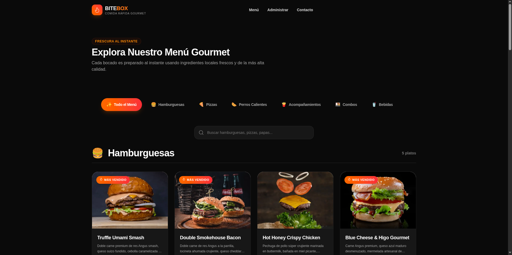
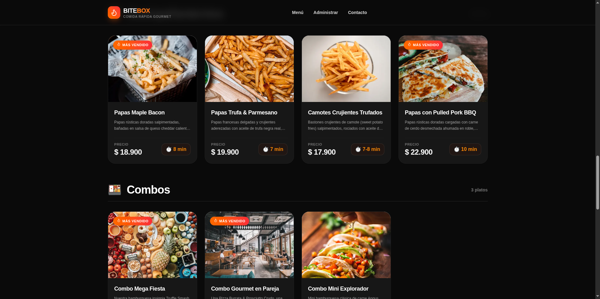

<div align="center">

# 🔥 BITEBOX

### Comida Rápida Gourmet & Hamburguesas Premium


Aplicación web de menú interactivo con panel de administración para restaurante de hamburguesas premium.

[Ver Demo](#-demonstración) • [Características](#-características) • [Inicio Rápido](#-inicio-rápido)

</div>

---

## 📸 Capturas de Pantalla

> Agrega tus capturas en la carpeta [`screenshots/`](./screenshots/) y referencialas aquí.

<!-- Descomenta y reemplaza con tus imágenes -->
<!--
| Captura | Descripción |
|---------|-------------|
|  | Vista principal del menú interactivo |
|  | Panel de administración |
|  | Login de administración |
|  | Versión móvil responsive |
-->

## Menú de Página Web



## Sección Comidas Rápidas



---

## 🚀 Características

### Menú Interactivo
- **Filtrado por categorías** — Hamburguesas, Pizzas, Perros Calientes, Acompañamientos, Combos y Bebidas
- **Búsqueda en tiempo real** — Encuentra platos por nombre o descripción
- **Diseño responsive** — Se adapta a cualquier tamaño de pantalla
- **Animaciones fluidas** — Transiciones suaves con Framer Motion

### Panel de Administración
- **CRUD completo** — Crear, leer, actualizar y eliminar platos del menú
- **Formularios validados** — React Hook Form + Zod para validación robusta
- **Restaurar menú** — Volver al menú original con un clic
- **Estadísticas** — Total de platos, categorías activas y platos populares
- **Vista de tabla** — En desktop, vista organizada de todos los platos
- **Vista de cards** — En móvil, diseño de tarjetas optimizado

### Seguridad
- **Autenticación JWT** — Sesiones seguras con `jose`
- **Middleware protegido** — Rutas admin protegidas automáticamente
- **Cookies HttpOnly** — Protección contra XSS
- **Variables de entorno** — Credenciales fuera del código fuente

### Experiencia de Usuario
- **Dark mode** — Tema oscuro por defecto
- **Loading states** — Skeletons mientras carga el contenido
- **Error handling** — Páginas de error y 404 personalizadas
- **Toast notifications** — Notificaciones de acciones realizadas
- **SEO optimizado** — Metadata, Open Graph y sitemap

---

## 🛠️ Tecnologías

| Categoría | Tecnología | Versión |
|-----------|------------|---------|
| Framework | Next.js | 16.x |
| UI Library | React | 19.x |
| Lenguaje | TypeScript | 5.x |
| Estilos | Tailwind CSS | v4 |
| Animaciones | Framer Motion | 12.x |
| Iconos | Lucide React | 1.x |
| Formularios | React Hook Form | 7.x |
| Validación | Zod | 4.x |
| Auth JWT | jose | 6.x |
| Testing | Vitest + Testing Library | 4.x |

---

## ⚡ Inicio Rápido

### Prerrequisitos

- Node.js 18+ 
- npm o yarn

### Instalación

```bash
# 1. Clonar el repositorio
git clone https://github.com/tu-usuario/bitebox.git
cd bitebox

# 2. Instalar dependencias
npm install

# 3. Configurar variables de entorno
cp .env.example .env.local
```

### Variables de Entorno

Crea un archivo `.env.local` en la raíz del proyecto:

```env
# Credenciales de administración
ADMIN_EMAIL=admin@bitebox.com
ADMIN_PASSWORD=tu_contraseña_segura

# Secreto para sesiones JWT
SESSION_SECRET=tu_secreto_aleatorio_minimo_32_caracteres
```

### Ejecutar

```bash
npm run dev
```

Abre [http://localhost:3000](http://localhost:3000) en tu navegador.

---

## 📜 Scripts Disponibles

| Comando | Descripción |
|---------|-------------|
| `npm run dev` | Inicia servidor de desarrollo |
| `npm run build` | Construye para producción |
| `npm run start` | Inicia servidor de producción |
| `npm run lint` | Ejecuta ESLint |
| `npm run format` | Formatea código con Prettier |
| `npm run format:check` | Verifica formato sin modificar |
| `npm test` | Ejecuta tests con Vitest |
| `npm run test:watch` | Tests en modo watch |
| `npm run typecheck` | Verifica tipos TypeScript |

---

## 📁 Estructura del Proyecto

```
bitebox/
├── app/                        # App Router (páginas, layouts, server actions)
│   ├── admin/                  # Panel de administración
│   │   ├── login/page.tsx      # Login de administración
│   │   └── page.tsx            # Dashboard admin (CRUD)
│   ├── actions/                # Server Actions
│   │   └── auth.ts             # Login y logout
│   ├── lib/                    # Utilidades del servidor
│   │   └── session.ts          # Gestión de sesiones JWT
│   ├── __tests__/              # Tests de integración
│   ├── layout.tsx              # Layout raíz
│   ├── page.tsx                # Página principal (menú)
│   ├── loading.tsx             # Estado de carga
│   ├── error.tsx               # Error boundary
│   ├── not-found.tsx           # Página 404
│   ├── globals.css             # Estilos globales
│   ├── robots.ts               # SEO: robots.txt
│   └── sitemap.ts              # SEO: sitemap.xml
├── components/                 # Componentes reutilizables
│   ├── CategorySlider.tsx      # Slider de categorías
│   ├── ConfirmModal.tsx        # Modal de confirmación
│   ├── Header.tsx              # Cabecera sticky
│   ├── ProductCard.tsx         # Tarjeta de producto
│   ├── ProductGrid.tsx         # Grilla de productos
│   ├── SectionTitle.tsx        # Título de sección
│   └── Skeleton.tsx            # Skeleton loader
├── context/                    # Contextos de React
│   ├── MenuContext.tsx          # Estado global del menú
│   └── ToastContext.tsx         # Sistema de notificaciones
├── data/                       # Datos y tipos
│   └── foodData.ts             # Interface FoodItem + datos de semilla
├── public/                     # Archivos estáticos
├── screenshots/                # Capturas de pantalla (para docs)
├── middleware.ts                # Middleware de autenticación
├── next.config.ts              # Configuración de Next.js
├── tailwind.config.ts          # Configuración de Tailwind
├── vitest.config.ts            # Configuración de tests
└── package.json
```

---

## 🔐 Autenticación

El sistema de autenticación utiliza JWT (JSON Web Tokens) con la librería `jose`:

1. **Login** — Las credenciales se validan contra las variables de entorno
2. **Sesión** — Se genera un JWT con expiración de 7 días
3. **Cookie** — Se almacena en una cookie HttpOnly segura
4. **Middleware** — Las rutas `/admin/*` se protegen automáticamente
5. **Logout** — Se elimina la cookie y se redirige al login

**Credenciales por defecto:**
```
Email: admin@bitebox.com
Contraseña: (configura en .env.local)
```

---

## 🧪 Testing

```bash
# Ejecutar todos los tests
npm test

# Modo watch (re-ejecuta al cambiar archivos)
npm run test:watch
```

Los tests están ubicados en `app/__tests__/` y utilizan:
- **Vest** — Runner de tests
- **Testing Library** — Pruebas de componentes React
- **jsdom** — Simulación del DOM del navegador

---

## 📱 Responsive Design

La aplicación está diseñada para funcionar en múltiples dispositivos:

| Breakpoint | Comportamiento |
|------------|----------------|
| `< 640px` | Layout móvil, cards apiladas |
| `640px - 1024px` | Grid de 2 columnas |
| `> 1024px` | Grid de 3-4 columnas, tabla admin |

---

## 🎨 Paleta de Colores

| Color | Hex | Uso |
|-------|-----|-----|
| Orange 500 | `#f97316` | Accent principal |
| Red 500 | `#ef4444` | Gradiente, hover |
| Neutral 950 | `#0a0a0a` | Background dark |
| White | `#ffffff` | Background light |

---

## 🚀 Deployment

### Vercel (Recomendado)

```bash
# Instalar CLI de Vercel
npm i -g vercel

# Desplegar
vercel
```

### Docker

```dockerfile
FROM node:18-alpine AS builder
WORKDIR /app
COPY package*.json ./
RUN npm ci
COPY . .
RUN npm run build

FROM node:18-alpine AS runner
WORKDIR /app
COPY --from=builder /app/.next/standalone ./
COPY --from=builder /app/.next/static ./.next/static
COPY --from=builder /app/public ./public

EXPOSE 3000
ENV PORT=3000
CMD ["node", "server.js"]
```

---

## 📄 Licencia

Este proyecto es privado. Todos los derechos reservados.

---


<div align="center">

Hecho con ❤️ para los amantes de la buena comida

</div>
